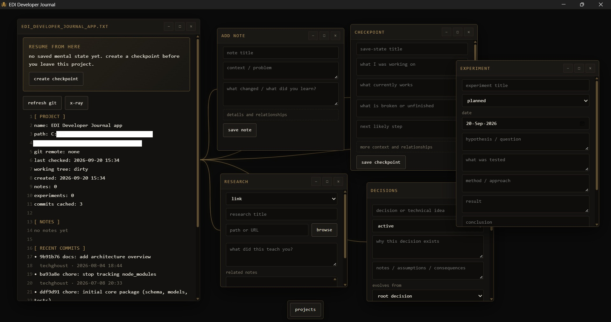

# EDI DEVELOPER JOURNAL

local-first desktop journal that stores the reasoning behind software projects: decisions, experiments, research, assumptions, failures and the context needed to continue the work later

current version: `0.1.0`



---

# THE PROBLEM

Git remembers what changed, but it does not remember why it changed. after a break you can recover the code and still forget which alternatives were rejected, which assumptions were wrong, what an experiment proved or what should happen next. EDI Developer Journal keeps that missing context next to the project without changing the repository

---

## HOW IT WORKS

each registered project has its own memory:

```text
[ repository / project folder ]
               ↓
        EDI project memory
               ↓
[ notes / checkpoints / decisions ]
[ research / experiments / assumptions ]
               ↓
      WHY? / Resume From Here
```

the application reads local Git metadata and stores journal data in its own SQLite database. source files stay in the original project folder

---

## CORE IDEA

project history is more than a list of commits. EDI stores the connection between code and thought:

- a note can reference commits and tags;
- a checkpoint records the current state and next step;
- a decision can point to evidence, assumptions and another decision;
- an experiment records a hypothesis, method, result and conclusion;
- research can be connected to notes, decisions and experiments;
- X-Ray dependencies can be connected to the memory that explains why they exist

---

## PROJECT MEMORY

### notes

notes store implementation details, discoveries and unfinished thoughts. existing notes can be opened, edited and deleted

### checkpoints

checkpoints preserve:

- what you are working on;
- what currently works;
- what is broken or unfinished;
- what you are trying to understand;
- decisions already made;
- rejected alternatives;
- open questions;
- the next step

### decisions

decisions can be active, experimental, superseded or rejected. temporary decisions can include a revisit condition or date and remain visible as decision debt

### research

research items support notes, links, PDFs, images and videos. a local file selected through `browse` is copied into the application's managed storage

### experiments and assumptions

experiments store what was tested and what the result means. assumptions can be active, questioned or invalidated. EDI shows when a decision or experiment depends on an assumption that is no longer trusted

### failure memory

failed, inconclusive and abandoned experiments remain visible. rejected and superseded decisions remain part of the history instead of disappearing

---

## RESUME FROM HERE

`Resume From Here` combines:

- the latest checkpoint;
- open decisions;
- recent notes;
- active experiments;
- Git activity;
- the suggested next step

the result is a compact project state for returning after a break

---

## WHY?

`Why?` opens the context behind a memory item. depending on the item, it can show related commits, files, notes, research, decisions, experiments and assumptions

---

## GIT INTEGRATION

EDI reads:

- the current HEAD commit;
- the remote URL when available;
- working tree state;
- changed and untracked file counts;
- recent commit metadata

EDI does not commit, reset, checkout or edit repository files

when a registered Git repository is moved, EDI searches for a unique repository with matching history and updates the saved path automatically. if no safe match is found, `relocate` allows the new folder to be selected manually

---

## X-RAY

X-Ray reads `package.json` and, when available, `package-lock.json`

it shows:

- direct and transitive dependencies;
- dependency relationships;
- source files that use a direct dependency;
- possible impact of removing a dependency;
- project memory linked to a dependency

removal simulation is informational. it does not uninstall packages or edit the project

X-Ray currently supports npm dependency analysis. projects from other ecosystems return an empty report

---

## INSTALL ON WINDOWS

1. open the [latest GitHub release](https://github.com/techghoust/edi-developer-journal/releases/latest);
2. download `EDI Developer Journal_*_x64-setup.exe`;
3. run the installer;
4. open `EDI Developer Journal` from the Start menu

the installer contains the application. Node.js, Rust and the source code are not required to use it

the current release is unsigned, so Windows SmartScreen may show a warning. download releases only from this repository

on first launch the project list is empty. EDI does not include example projects, developer data or another user's journal

---

## FIRST PROJECT

1. enter the project name;
2. choose the repository folder with `browse`;
3. enable `allow folder without Git` only for a non-Git folder;
4. select `create project`;
5. open the project from `Recent Projects`

adding a project does not copy or modify its source files

---

## BUILD FROM SOURCE

### requirements

- Windows 10 or Windows 11;
- Git;
- Node.js 24 with npm;
- stable Rust toolchain;
- Microsoft C++ Build Tools;
- Microsoft Edge WebView2 Runtime

### clone and install

```powershell
git clone https://github.com/techghoust/edi-developer-journal.git
cd edi-developer-journal
npm ci
```

### run in development

```powershell
npm start
```

### build the application

```powershell
npm run build:tauri
```

release files are written under:

```text
src-tauri/target/release/bundle/nsis
```

tagged versions are built as Windows installers by GitHub Actions and attached to the matching GitHub Release

---

## EXPORT / IMPORT

`export JSON` writes the selected project memory to a readable JSON file. it includes notes, checkpoints, decisions, research, experiments, assumptions and X-Ray memory links

`import JSON` merges a compatible export into the project whose settings window is open. existing records are preserved. importing the same records again does not create duplicates

local media files are not embedded in JSON. copy the application data directory when a backup must include attachments

---

## DATA AND PRIVACY

on a fresh Windows installation, EDI stores its database and managed attachments in:

```text
%APPDATA%\EDI Developer Journal
```

no account is required. project source files remain in their original folders

deleting a project from EDI removes its journal memory. repository files stay on disk

remote media URLs still depend on the original website and an internet connection

---

## PROJECT STRUCTURE

```text
apps/
  desktop/
    src/renderer/

packages/
  core/
    src/db/
    src/git/
    src/models/
    test/

src-tauri/
  src/
  icons/

assets/
docs/
```

---

## DEVELOPMENT COMMANDS

```powershell
npm start
npm run typecheck
npm test
npm run build
npm run build:tauri
npm run release:windows
```

if `better-sqlite3` must compile locally, Node.js also needs Python and the Visual Studio C++ toolchain

---

## TESTING

```powershell
npm run typecheck
npm test
cargo test --manifest-path src-tauri/Cargo.toml
```

TypeScript tests are built with Vitest. the native application uses Rust unit tests

---

## TECH STACK

- Rust;
- Tauri;
- JavaScript;
- TypeScript;
- HTML + CSS;
- SQLite;
- Vitest

---

## CURRENT LIMITATIONS

- Windows is the current desktop target;
- X-Ray analyzes npm projects only;
- JSON exports do not contain local media files;
- imported memory is merged into an existing project;
- development builds are not code-signed

---

## USER GUIDE

see [docs/USER_GUIDE.md](docs/USER_GUIDE.md)
